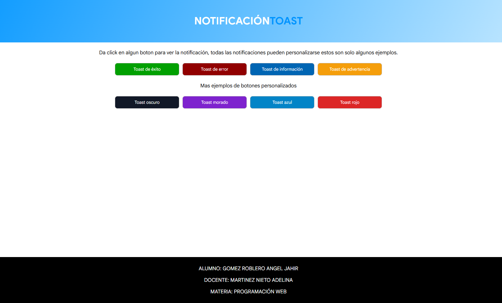
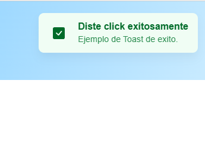
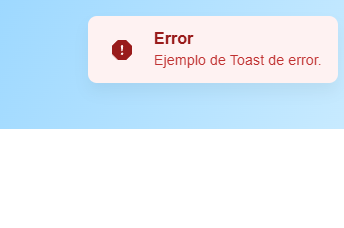
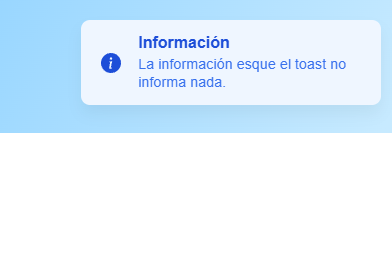
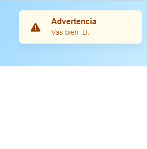

# Actividad 3: Componente Visual con JavaScript

**Instituto Tecnológico de Oaxaca**  
**Alumno:** GOMEZ ROBLERO ANGEL JAHIR  
**Docente:** MARTINEZ NIETO ADELINA  
**Materia:** Programación Web  
**Hora:** 10:00-13:00  
**Actividad:** Componente Visual con JS

# Notificación Toast

## ¿Qué es este componente?

Este proyecto contiene un componente visual tipo **Toast**, el cual sirve para mostrar notificaciones rápidas dentro de una página web.

Una notificación Toast permite mostrar mensajes como:

- Operaciones exitosas
- Errores
- Advertencias
- Información importante

El componente aparece en pantalla sin cambiar de página y sin interrumpir completamente la navegación del usuario.

## Problema que resuelve

En muchas páginas web se necesita mostrar mensajes rápidos al usuario. Por ejemplo, cuando se guarda información, ocurre un error, se necesita mostrar una advertencia o se quiere comunicar información importante.

Este componente resuelve ese problema mostrando una notificación visual reutilizable con título, mensaje, tipo, duración, icono y colores personalizables.

## Tecnologías utilizadas

- HTML
- CSS
- JavaScript
- Iconos SVG
- GitHub Pages

## Estructura del proyecto

```txt
ACTIVIDAD3-COMPONENTEVISUAL/
│
├── README.md
├── index.html
│
├── css/
│   └── styles.css
│
├── js/
│   ├── app.js
│   └── componente.js
│
└── img/
    ├── exclamacion.svg
    ├── flechitaDeListo.svg
    ├── informacion.svg
    ├── peligro.svg
    ├── notificacionAdvertencia.png
    ├── notificacionError.png
    ├── notificacionExito.png
    ├── notificacionInformacion.png
    └── paginaPrincipal.png
```

---

## Instalación

Antes de cerrar la etiqueta `body`, se agrega el archivo JavaScript del componente.

```html
<script src="js/componente.js"></script>
```

El archivo `componente.js` contiene la lógica principal del componente Toast incluyendo sus estilos.

## Uso básico

Para mostrar una notificación se llama la función `notificacionToast()`.

```js
notificacionToast(
  "Guardado correctamente",
  "Los datos se registraron sin problemas.",
  "exito",
  4000,
);
```

## Parámetros del componente

La función recibe los siguientes parámetros:

```js
notificacionToast(
  titulo,
  mensaje,
  tipo,
  duracion,
  icono,
  colorDeFondo,
  colorDeTitulo,
  colorMensaje,
  colorIcono,
);
```

| Parámetro       | Descripción                             |
| --------------- | --------------------------------------- |
| `titulo`        | Título principal de la notificación     |
| `mensaje`       | Texto que se muestra dentro del Toast   |
| `tipo`          | Tipo de notificación                    |
| `duracion`      | Tiempo que dura visible en milisegundos |
| `icono`         | Ruta del icono o icono personalizado    |
| `colorDeFondo`  | Color de fondo del Toast                |
| `colorDeTitulo` | Color del título                        |
| `colorMensaje`  | Color del mensaje                       |
| `colorIcono`    | Color del icono                         |

## Tipos de notificación

El componente tiene cuatro tipos principales:

```js
"exito";
"error";
"informacion";
"advertencia";
```

Cada tipo cambia el estilo visual de la notificación para que el usuario pueda identificar rápidamente el mensaje.

## Ejemplos de uso

### Toast de éxito

```js
function pruebaToastExito() {
  notificacionToast(
    "Diste click exitosamente",
    "Ejemplo de Toast de éxito.",
    "exito",
    4000,
  );
}
```

### Toast de error

```js
function pruebaToastError() {
  notificacionToast("Error", "Ejemplo de Toast de error.", "error", 4000);
}
```

### Toast de información

```js
function pruebaToastInformacion() {
  notificacionToast(
    "Información",
    "Esta notificación muestra información general para el usuario.",
    "informacion",
    4000,
  );
}
```

### Toast de advertencia

```js
function pruebaToastAdvertencia() {
  notificacionToast(
    "Advertencia",
    "Revisa la información antes de continuar.",
    "advertencia",
    4000,
  );
}
```

## Ejemplos personalizados

El componente también permite personalizar colores e iconos.

### Toast oscuro

```js
function toastOscuro() {
  notificacionToast(
    "Ejemplo de modo oscuro",
    "Cambiamos el color de la notificación.",
    "informacion",
    4000,
    "img/informacion.svg",
    "#111827",
    "#ffffff",
    "#d1d5db",
    "#38bdf8",
  );
}
```

### Toast morado

```js
function toastMorado() {
  notificacionToast(
    "Morado",
    "Ejemplo de Toast con color morado.",
    "informacion",
    4000,
    "img/informacion.svg",
    "#f3e8ff",
    "#6b21a8",
    "#7e22ce",
    "#9333ea",
  );
}
```

### Toast azul

```js
function toastAzul() {
  notificacionToast(
    "Ejemplo de color azul",
    "Cambiamos la notificación a color azul.",
    "exito",
    4000,
    "img/flechitaDeListo.svg",
    "#e0f2fe",
    "#075985",
    "#0369a1",
    "#0284c7",
  );
}
```

### Toast rojo

```js
function toastRojo() {
  notificacionToast(
    "Ejemplo de color rojo oscuro",
    "Podemos personalizar todo el diseño.",
    "error",
    4000,
    "img/exclamacion.svg",
    "#450a0a",
    "#ffffff",
    "#fecaca",
    "#ef4444",
  );
}
```

## Código HTML de ejemplo

```html
<div class="botones">
  <button onclick="pruebaToastExito()">Toast de éxito</button>

  <button onclick="pruebaToastError()">Toast de error</button>

  <button onclick="pruebaToastInformacion()">Toast de información</button>

  <button onclick="pruebaToastAdvertencia()">Toast de advertencia</button>
</div>
```

## Características del componente

- Es reutilizable.
- Se puede llamar con distintos textos.
- Permite diferentes tipos de notificación.
- Acepta iconos personalizados.
- Permite cambiar colores.
- Se oculta automáticamente después de cierto tiempo.
- Genera su estructura visual desde JavaScript.
- Genera dinámicamente sus estilos principales desde JavaScript.
- No utiliza frameworks externos como React, Vue o Angular.
- Puede insertarse en cualquier página HTML usando el archivo `componente.js`.

## Capturas de pantalla

### Página principal



### Ejemplo de Toast de éxito



### Ejemplo de Toast de error



### Ejemplo de Toast de información



### Ejemplo de Toast de advertencia



---

## Video de demostración

[Ver video de demostración](https://youtu.be/LEMyWt2sM-U)

---

## GitHub Pages

[Ver página en GitHub Pages](https://jahirroblero.github.io/ProgramacionWeb-Actividad3-7SB/)

---

## Repositorio

[Ver repositorio en GitHub](https://github.com/JahirRoblero/ProgramacionWeb-Actividad3-7SB)

---

## Conclusión

Este componente tipo Toast permite mostrar notificaciones visuales de forma sencilla y reutilizable dentro de una página web.

Su uso es práctico porque puede adaptarse a diferentes situaciones mediante parámetros como título, mensaje, tipo, duración, icono y colores.
